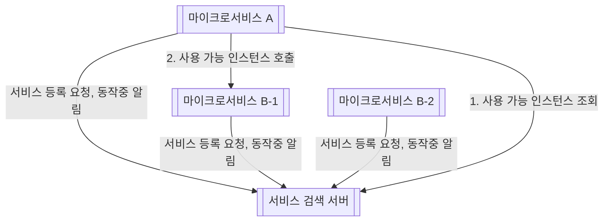

# 9장 넷플릭스 유레카를 사용한 서비스 검색

---

### 유레카가 해결하는 서비스 검색 고려사항

- DNS 기반 서비스 검색 대체
    - **DNS 기반 서비스 검색 개념**
        - 라운드 로빈(Round-robin) 방식의 DNS 를 사용하게 되면 **같은 인스턴스 명을 사용하여 IP 주소를 등록**한다.
        - 하지만 DNS 클라이언트는 일반적으로 사용중인 IP 주소를 계속 사용하여 요청 시 마다 라운드 로빈 방식을 적용하지 않는다.
- 언제든 새 인스턴스가 시작될 수 있다.
- 언제든 기존 인스턴스가 응답하지 않고 중단될 수 있다.
- 요청 처리에 실패한 인스턴스 중 일부는 다시 트래픽을 정상 수신 하지만 그렇지 못한 인스턴스는 서비스 레지스트리에서 제거해야 한다.
- 일부 서비스 인스턴스는 시작 시간이 오래 걸릴 수 있기 때문에, 요청을 수신해도 해당 인스턴스로 트래픽을 라우팅하지 못할 수 있다.
- 언제든 의도치 않은 네트워크 파티셔닝 혹은 오류가 발생할 수 있다.

### 사용

- **확장 / 축소**
    - 인스턴스 수를 추가하거나 축소해서 실행할 때, 유레카 로드 밸런서가 인스턴스 호출 시 라운드 로빈 방식을 사용해서 라우팅하기 때문에 문제없이 모든 인스턴스가 돌아가면서 요청에 응답한다.
- **유레카 서버 중지 시 장애 대응**
    - 클라이언트가 마이크로서비스 인스턴스에 대해 정보를 이미 읽었다면 로컬 캐시를 통해 기존 인스턴스에 대해 요청이 가능하다.
    - 어떤 마이크로 서비스가 중단되면, 해당 서비스의 모든 정보를 알 수 없다. 이는 시간 초과 / 재시도 등의 복원 매커니즘으로 방지할 수 있다.
    - 새 인스턴스가 생성되면, 유레카 서버는 중지되어 있기 때문에 첫 번째 인스턴스로 모든 트래픽이 전달된다.
