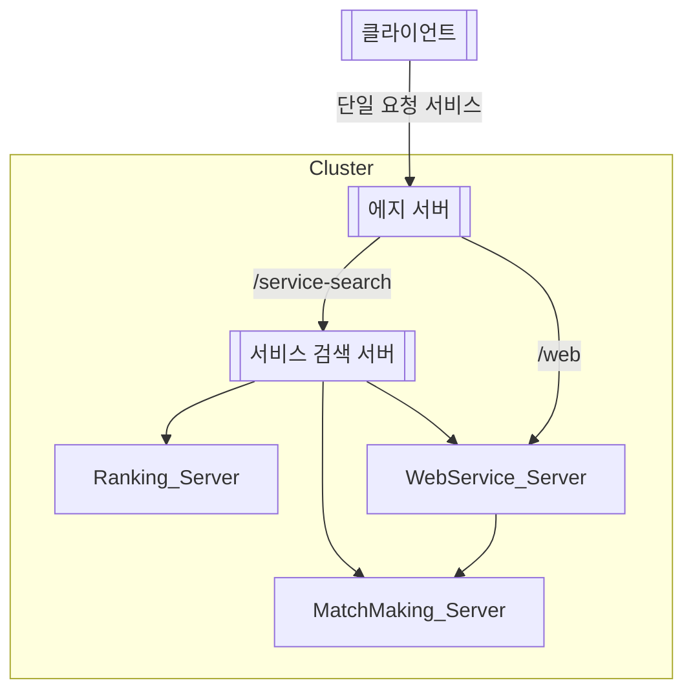

# 10장 스프링 클라우드 게이트웨이를 에지 서버 사용

---

### 구성

스프링 클라우드 게이트웨이 구성시 가장 중요한 것은 라우팅 규칙이다.

- **라우팅 규칙**
    - 조건자 - 수신되는 HTTP 요청 정보를 바탕으로 경로 선택
    - 필터 - 요청 혹은 응답을 수정
    - 대상 URI - 요청을 보낼 대상
    - ID - 라우팅 경로 이름
